# Predictions of online engagement for Dunkin Donuts tweets

<!-- Justify text. -->

## The project’s objective

The aim of this project is to help the social media manager of **Dunkin
Donuts** to predict online engagement for his next tweet and also
understanding the main drivers of engagement in twitter.

## The Project’s steps

### Retrieving Data

The first thing we started with, is to get tweets posted by **Dunkin
Donuts** official Twitter account while excluding **Retweets &
Replies**.  
Using the Pagination, we ended up having a total of `793 tweets` with
the following columns: `author_id`, `conversation_id`, `source`,
`possibly_sensitive`, `id`, `text`, `reply_settings`, `lang`,
`created_at`, `referenced_tweets`, `in_reply_to_user_id`,
`public_metrics.retweet_count`, `public_metrics.reply_count`,
`public_metrics.like_count`, `public_metrics.quote_count`,  
`entities.annotations`, `entities.urls`, `entities.mentions`,
`entities.hashtags`, `attachments.media_keys`, `attachments.poll_ids`.

### Feature Engineering

After binding all the tweets together in the same dataframe, we thought
about creating new variables based on the one we got from Twitter. These
tweets will bring more insights to our analysis and will help in
creating our prediction model.

The main features we came up with in this step are:

\-`Engagement variable` based on weighted average of likes, replies,
quotes and retweets.  
-`Engagement categories` based on quantiles \[1,4\].  
-`Tweet Length` of original tweet with all hashtags and urls.  
-`Clean Tweet Length` after removing all hashtags and urls.  
-`Is_weekend` precising whether the tweet was posted during a weekday or
not.  
-`Upper_count`giving the number of uppercase words per tweet.  
-`Exclamation_count`showing the frequency of exclamation marks inside
the tweets.  
-`Hashtag_ct` counting the number of hashtags per tweet.  
-`Photos_count` precising the number of photos existing as an attachment
by tweet.  
-`Videos_count`precising the number of videos existing as an attachment
by tweet.  
-`Gifs_count`precising the number of gifs existing as an attachment by
tweet.  
-`Other_media_count`precising the number of media types other than
photos, videos and gifs, existing as an attachment by tweet.  
-`Emojis_count` giving the number of emojis per tweet.

### Sentiment Analysis

In the meantime, we worked on assigning sentiment for our corpus.  
For this step, we tried different **dictionary-based approach**
libraries, citing mainly:  
- `Sentimentr`: which is designed to quickly calculate text polarity
sentiment in the English language at the sentence level, by attempting
to take into account valence shifters (i.e., negators, amplifiers
(intensifiers), de-amplifiers (downtoners), and adversative
conjunctions) while maintaining speed.  
To analyze sentiment using this library we had to make some changes to
our corpus by remove numbers, punctuation, URLs, hashtags, mentions,
controls, special characters, leading and trailing white spaces and
finally converting all the text to lowercase.  
- `Vader`: which is developed to deal with the language patterns used in
social media such as: words that increase the sentiment like **great**
or **love**, words that are all caps are often used to amplify emotion,
marks such as **!** or **!!!** will increase the sentiment, social media
slang words and emojis.  
As for this method, we did not need to bring any changes to the corpus
so we applied the function directly to the raw tweets’ text. After
comparing these two methods’ results, we chose to consider the **Vader**
results since they were more accurate when doing random check on the
data to see if the sentiment assigned goes with the content of the tweet
or not.

### Topics’ modeling

As an additional feature we extracted the main topic for the tweets by
implementing an LDA analysis. - As a first step we removed the emojis,
normalized the text and removed irrelevant words (for the topic
modeling). For this last step we identified the part of speech of each
word in the tweet and after this we used the words classified as
Adjectives, nouns, proper nouns and interjections. As a final step for
cleaning we used the lemmatisation to extract the intended meaning of
the words.

-   The second part of the analysis is related to finding the optimal
    number of topics for the LDA. For this process we calculated the
    metrics Griffiths2004, CaoJuan2009, Arun2010 and Deveaud2014. The
    graph corresponding to the metrics curves is shown below.
    

    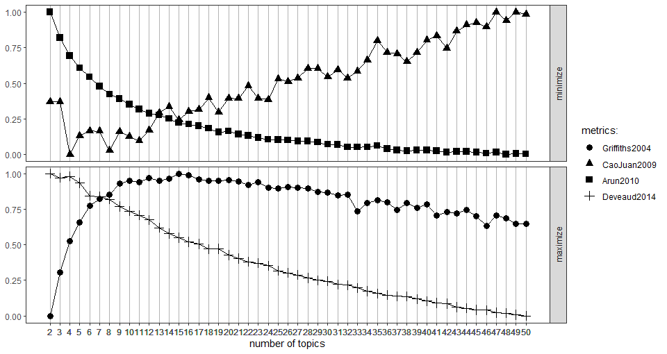
    

    metrics LDA
    

    

-   According to the results the optimal number of topics is between 5
    and 12, After iterating with different values we found a
    classification of 6 important topics which can be identified by the
    main words in the figure 2

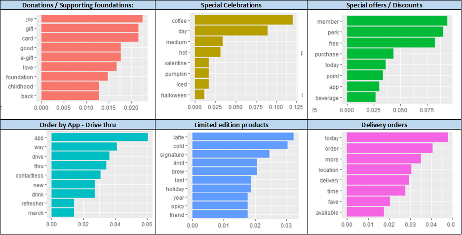

Topics description

-   Finally, after analyzing the results we observed that the tweets
    with the lowest relationship with the topics were related to random
    topics or were very short to identify the real topic. For this
    reason we created a different topic to include the tweets with
    gammas less than 19%, this category is identified as “Others”

### Model creation & evaluation

The team proceeded with the model creation firstly by creating dummy
variables of all categorical variables present in the selected features.
Once these variables were added, the target variable was defined to be
the **engagement_categ**, setting the purpose of the model to be a
classification of the tweet between all pre-defined engagement
categories, ranging from 1 to 4, where 1 is the less engaging and 4 the
most engaging tweets categories.

The next step of this process was to split the data into training and
testing set, choosing a stratified partition of 80% for the training and
20% for the test sets. Once we had the data ready to be processed, we
compared different models’ performance and chose the Multinomial Neural
Network, provided by the **nnet** R package. The model predicted the
tweets of the testing set in terms of probability for each category and
we selected the highest probability as the chosen label.

For the evaluation process we used the **ROCR** R package which allowed
us to evaluate the AUC of the model, obtaining an AUC of approximately
`71%`. The graph corresponding to the ROC curves of the model is shown
below.

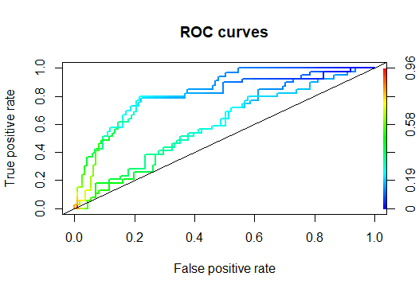

ROC Curves

## Insights

### Overview

-   Dunkin Donuts had the highest peak of tweets for the period of
    analysis, during **September 2020**, with tweets about the
    **National Dunkin day** that took place on Tuesday, September 29,
    2020, calling customers to visit DD’s locals and announcing
    different offers on that occasion (`60 tweets`).

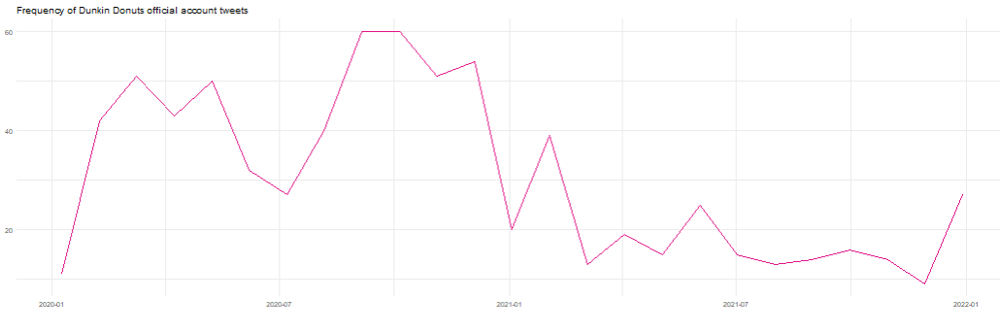

-   The majority of Dunkin Donuts tweets were publishing during the
    afternoon `64%`, followed by tweets posted during the evening `28%`,
    with a dominance for tweets published in the **weekdays** rather
    than **weekends**. 

-   **Diverse tweets** are the one dominating the coverage with `34%` of
    the share of voice, followed by tweets announcing **special offers**
    `14%`, and **special celebrations** posts `13%`.  

-   Most of the tweets are with length around the **ideal tweet’s
    length** which is **100 characters**, with the range \[60-80\]
    characters being the one with the highest number of tweets
    `114 tweets`.

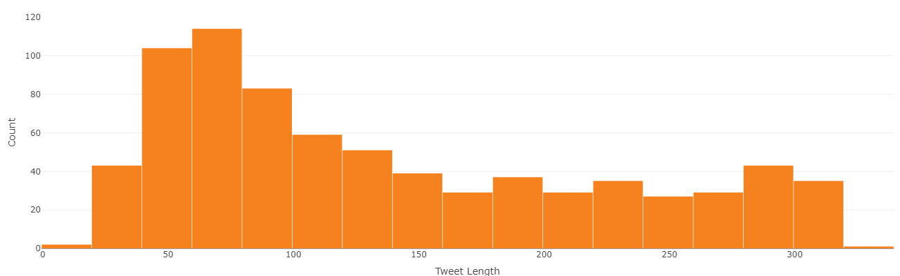

-   Positive tweets are dominating the coverage with `59%` of overall
    tweets.  
-   Positive tweets are keeping the lead of SOV overtime, with the
    highest peak being recorded during **April 2020**. This peak is
    fueled by posts praising the role played by the healthcare staff to
    save lives during the pandemic.  
    

    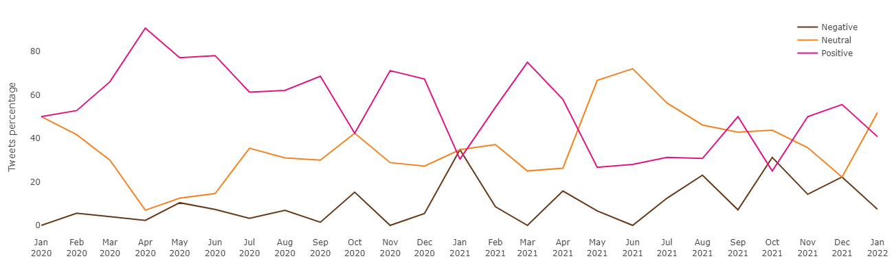
    

    ROC Curves
    

    

-   `53%` of the total Dunkin Donuts tweets are tweets with **media
    attachements**, with **photos** being the most frequent media type
    to include with tweets `76%`.

### Engagement

-   In the graph shown below, it is perceivable that Dunkin Donuts’
    tweets vary within the engagement categories, therefore, their posts
    are not constant in terms of connecting to the people. As an example
    we can perceive that the peak for the **Not Engaging** category was
    during the month of **Dec 2020** whereas the peak for **Highly
    Engaging** tweets was during **September** of the same year.

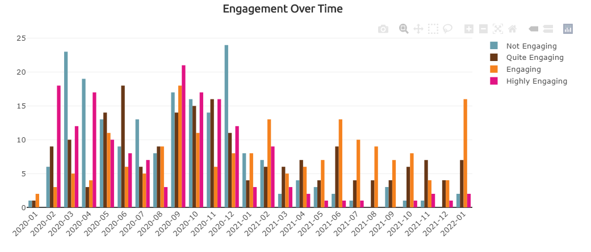

-   As it is displayed in the **Engagement vs Day Over Time** graph,
    most of the tweets published by DD are done during weekdays,
    therefore, there is no proof that the day of the week affects the
    engagement of the tweet. Also, the month of **September** is the
    highest engaging month, due to the **#NationalDunkinDay**.

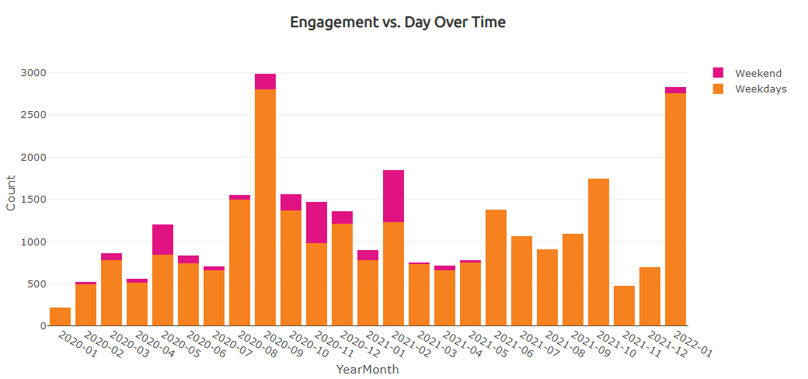

-   The **Engagement vs. Topics** chart displays the distribuion of each
    topic vs engagement. Clearly, we can see that the most engaging
    topics are: **Special Celebrations ** and **Others**, followed by
    **Order by App/ Drive Thru**.

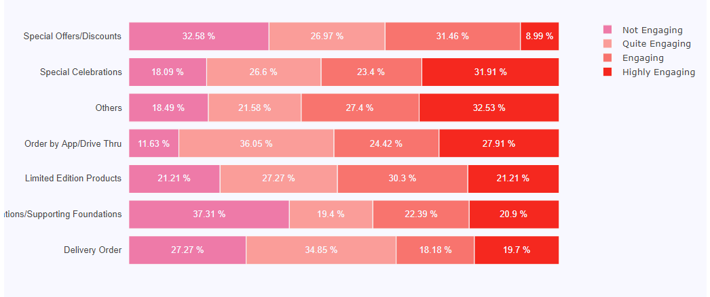

-   In the **Engagement vs Media** graph, we analyze the impact of media
    on tweet’s engagement. Counterintuitively, highest engaging tweets
    do not contain media. However, most of the tweets belonging to the
    subsequent categories contain media.

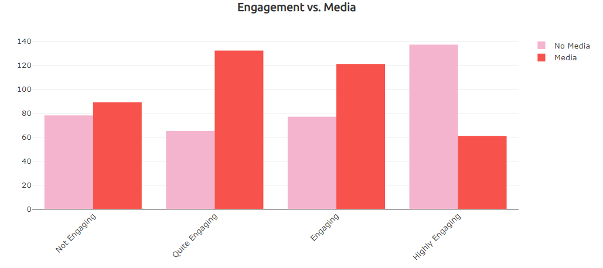

-   In the following barchart we can see the distribution of uppercase
    vs engagement categories. It is worth to mention that most highly
    engaging tweets contain from 1 to 4 uppercase letters, which
    suggests us that the normally redacted tweets are more engaging than
    those with overused uppercase letters.

-   We also analyzed the most and least engaging hashtags and resulted
    to be #NationalDunkinDay and \# respectively

-   In the **Engagement vs Sentiment Over Time** chart we can appreciate
    a similar distribution of engagement for all sentiment categories,
    only remarking the peak of negative sentiment for the month of
    **January 2022**. However, looking at the tweets of that month we
    could perceive that most of the tweets published used a sarcastic
    senes, and that’s the reason of the peak. Therefore, we could
    conclude that sarcastic tweets have a high engagement.

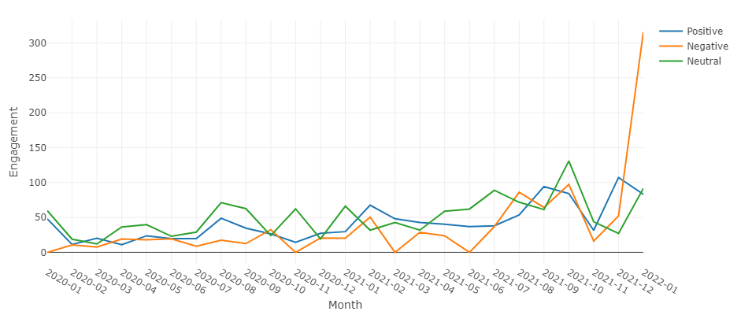

-   For the Engagement category over time we could not see a seasonality
    of the categories, as shown below in the graph.

-   In the bubble graph related to the tweet length we can see that most
    of the highly engaging tweets are of short length, whereas the low
    engaging tweets have a long length

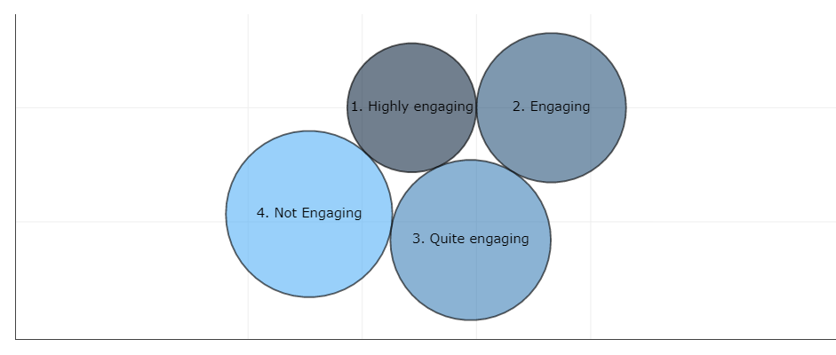

-   Looking at the time of the post vs engagement categories we can
    perceive that even if Late Night tweets are not common in the
    account, they are most frequently within the highly engaging
    category as displayed in the following graph

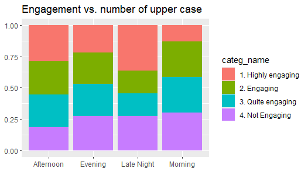

## Recommendations

After understanding and analyzing the information collected the team
found the following key drivers of engagement for Dunkin Donuts in
twitter:

1.  Tweets related to special celebrations like Halloween, Saint
    valentine’s day and National Donut day have special engagement, more
    than half of these tweets are highly engaging or engaging. However,
    the number of posts for these months is low. For this reason we
    encourage **Dunkin Donuts** to increase the number of posts for the
    months of **February and September**.

2.  A second important driver of engagement is related to the structure
    of the tweet. In this case we found that the most engaging tweets
    have an average length smaller than the not engaging tweets. Also,
    the tweets with less than **4 upper case letters** are 3 times more
    engaging than the ones with more upper case letters. Therefore, we
    recommend **Dunkin Donuts** to elaborate tweets with these
    characterstics.

3.  Next, we analysed the influence of media included in the tweets. In
    this aspect we found that tweets including **gifs** are specially
    engaging which leads us to the conclusion that the followers and
    interactions in ´Twitter for **Dunkin Donuts** are more attracted by
    the presence of **gifs** and those could be included more often as
    now the percentage of tweets including gifs is just 1.18%.

4.  Finally, according to the analysis the engagement of the tweets
    tends to be higher in the afternoons and late nights. Therefore,
    **Dunkin Donuts** could increase the number of tweets posted during
    **afternoons and evenings**. Because Twitter users tend to check on
    their accounts when finishing work/school or before sleeping.

## References

-   <https://cran.r-project.org/web/packages/vader/vader.pdf>
-   <https://stackoverflow.com/questions/37704212/extract-month-and-year-from-date-in-r>
-   <https://datascienceplus.com/sentiment-analysis-with-machine-learning-in-r/>
-   <https://towardsdatascience.com/a-guide-to-mining-and-analysing-tweets-with-r-2f56818fdd16>
-   <https://medium.com/analytics-vidhya/tweet-analysis-using-naive-bayes-algorithm-in-r-3f746d09bb0f>
-   <https://www.r-graph-gallery.com/267-reorder-a-variable-in-ggplot2.html>
-   <https://www.rdocumentation.org/packages/nnet/versions/7.3-12/topics/multinom?>
